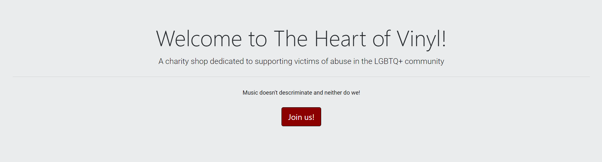

# Heart Of Vinyl

### Heart of Vinyl is a ficticional charity record shop, that specialises in vinyl trading and donation in-store.
### This charity shop is set to help victims of homophobic abuse, and provides a safe haven for people to meet and share their common interests through vinyl trading, donating and volunteering which also provides a sense of community, as _inclusiveness_ is the **motto** in this establishment.

### Everyone is welcome no matter the age, ethinicity, sexuality or beliefs.

# Features

## Existing Features

* Navbar

   * _The Heart Of Vinyl_ navbar contains 3 main links: Home, Gallery and Join US. The navbar is responsive and identical in all 3 pages. 
   For this Navbar the design has been kept simple and tidy in it's appearence. 

* Hero Image

  * The Hero Image has a static image that contains no animation, as it would be distracting and wouldn't fit with the main view of the page. 
  The hero image is trying to reach across the main message on this page, which is inclusiveness in LGBTQ+ community that is also connected throught the love of music. 

* Jumbotron

    * The Jumbotron layout is kept quite simple and neat. 
    The Jumbotron main function is to briefly explain the purpose of the Website and also extend an invitation for anyone that wishes to join the community, they can do so here through the **Join us** button.

    The Jumbotron also contains one of the very few color item links on the page. 

* Footer

    * The Footer is consituted by three columns.
    The first column contains the contact info of the store and it's address, by adding the contacts to the footer which is one of the main elements that is consistent in all 3 pages, the user is able to see it at all times, therefore making it easier to find.

    The second column contains all the social links in which the Website is represented. 
    All the icons are grey apart from one as it provides a nice eye catching feature the bottom of the page.
    Besides the single colour icon, each of the social icons have their own colour when hovering over them as well.

    The Third Column is an informative text about Donations to the charity shop. 
    By adding this to the footer it gives it importance but it doesn't make it look like it's the main objective of this charity shop.

* Gallery

   * The Gallery is the second page of _The Heart Of Vinyls_ website and it is constituted by the navbar, the footer and a selection of images forming a gallery display. 

   All the images are related to Vinyls themselves or music, and LGBTQ+ Community. 

   To Be able to make this images stand out from just becoming a static gallery, an image zoom animation was added for everytime it's hovered over. 

* Form / Join-Us

  * The Join Us form is the third and final page of the project. 
  In this page the user will be able to join _The Heart Of Vinyl_ community in a more personal way by volunteering in the store by completing the form. 

## Features Left to implement
* Dropdown menu;
* A more detailed about section;

# Technologies Used

* This project uses HTML, CSS and Bootstrap.
* The project was developed using Gitpod.
* This project uses GitHub for Storing and Deployment.

# Testing 

## Validator Testing
* CSS
  * No errors were found when testing on the official [Jigsaw validator](https://jigsaw.w3.org/css-validator/)

* HTML

  * No errors were found when testing on the official [W3C Validator](https://validator.w3.org/)

# Deployment 

* The website was deployed to GitHub pages.
The steps taken were the following:

  * Access the settings on the GitHub repository
  * On the left hand side menu, navigate and select the Master Branch.
  * Once the master branch is selected, the page will automatically refresh and display a message for the successful deployment.

* For GitHub page live link [Click here!](https://deborasantos28.github.io/milestone-project-1/)

# Credits

* For the Gallery I used the code from [MDB Bootstrap Static Gallery](https://mdbootstrap.com/docs/standard/extended/gallery/#section-lightbox) for a responsive and simple layout. A few alterations were made to the code along with the customized CSS. 

* For the Media Queries I used the W3Schools example provided. 

* This project was made by using some of Bootstraps code.

## Contents

## Resources 
* Images
  * [Rawpixel](https://www.rawpixel.com) 
  * [Unsplash](https://unsplash.com/)
  * [Pexels](https://www.pexels.com/)
  * [Pixabay](https://pixabay.com/)

* Colour Palette
  
  * [Colorswall](https://colorswall.com/palette/1450/) 
  * [U.S Brand Colors](https://usbrandcolors.com/twitter-colors/)
  * [Brand Palettes](https://brandpalettes.com/instagram-color-codes/)

